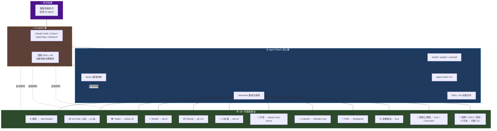

# 👁️ Agent Reach

> [!info] 📌 專案定位與解決的痛點
> **一句話定位**：開源的 AI Agent 互聯網能力擴展腳手架（Scaffolding），透過統一 CLI 將 Jina Reader、yt-dlp、twitter-cli、rdt-cli、gh CLI 等 16+ 種上游開源工具整合打包，讓 Claude Code / Cursor / OpenClaw 等 AI Agent **複製一句話就能自動安裝並具備讀網頁、抓推特、爬 Reddit、看 YouTube 字幕、訂閱 RSS 的能力**。
>
> **核心痛點**：AI Agent 能寫程式、改文件，但**沒有「上網」能力**。每個平台都有不同門檻——Twitter API 付費、Reddit 伺服器 IP 被封、小紅書要登入、B站海外被擋、YouTube 字幕難抓，全網搜尋品質差。Agent Reach 把選型、安裝、設定的髒活**一次打包全自動完成**。

## 🧠 核心架構心智圖



---

## 🚀 核心技術棧（Tech Stack）與主要特徵（Key Features）

### 🧱 技術棧

| 類別 | 技術 / 工具 |
|------|------------|
| **語言 / 版本** | Python 3.10+ |
| **授權** | MIT License |
| **核心 CLI** | `agent-reach`（pip 安裝）|
| **依賴調度** | Node.js、gh CLI、mcporter、twitter-cli、rdt-cli、yt-dlp |
| **搜尋引擎** | [Exa](https://exa.ai)（透過 MCP 接入，無需 API Key）|
| **網頁解析** | [Jina Reader](https://github.com/jina-ai/reader)（r.jina.ai）|
| **配置存儲** | `~/.agent-reach/config.yaml`（檔案權限 600）|
| **套件管理** | pip / pipx（xhs-cli、bilibili-cli 等）|

### ✨ 主要特徵

> [!success] 關鍵亮點
> - 🆓 **完全免費**：所有工具開源、API 免費，唯一可能花費是伺服器代理（~$1/月）
> - 🔒 **隱私安全**：Cookie 僅本地儲存，絕不上傳，程式碼完全開源可審查
> - 🔌 **可插拔架構**：每個平台是一個獨立 `channels/*.py` 檔案，不滿意直接換掉
> - 🤖 **Agent 通用**：相容 Claude Code、OpenClaw、Cursor、Windsurf 等所有 CLI Agent
> - 🩺 **內建診斷**：`agent-reach doctor` 一鍵檢測所有渠道狀態
> - 🛡️ **安全模式**：`--safe` 與 `--dry-run` 模式防止意外改動
> - 🔄 **持續更新**：底層工具自動追蹤更新，不用自己盯平台異動

### 📡 支援的 16+ 平台速覽

| 平台 | 開箱即用 | 解鎖後能力 |
|------|---------|-----------|
| 🌐 網頁 / 📡 RSS / 📺 YouTube / 📦 GitHub（公開）| ✅ 0 配置 | 私有倉庫、發 Issue/PR |
| 🐦 Twitter/X / 📖 Reddit / 📕 小紅書 / 🎵 抖音 | 讀單條 | 搜尋、發文、互動 |
| 📺 B站 / 💼 LinkedIn / 📈 雪球 / 🎙️ 小宇宙 | 部分功能 | 完整功能（需代理或 Cookie）|
| 🔍 全網搜尋 / 💬 微信公眾號 / 📰 微博 / V2EX | 自動配置 | — |

---

## ⚡ 快速上手步驟（安裝與執行命令）

### 📥 步驟一：安裝指令
使用 pip 安裝此 CLI 工具：
```bash
pip install agent-reach
```

### 🩺 步驟二：驗證安裝狀態
```bash
agent-reach doctor
```

### 💬 步驟三：呼叫方式
| 用途 | 指令 |
|------|------|
| 讀取 YouTube 影片 | `yt-dlp --dump-json URL` |
| 讀取推文 | `twitter tweet URL` |
| 搜尋 Reddit 貼文 | `rdt search QUERY` |
| 查看 GitHub 倉庫 | `gh repo view owner/repo` |
| 讀取 RSS 來源 | 使用 `feedparser` |
| 全網語意搜尋 | `mcporter call exa QUERY` |

---
*Generated and maintained by Google Antigravity Architect*
